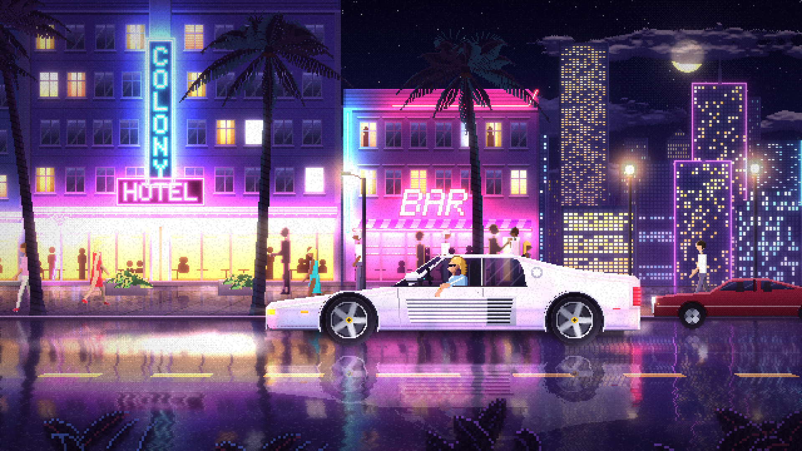
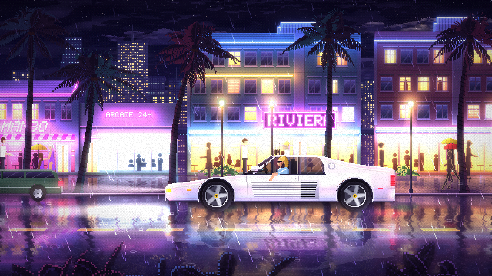

# Neon Drive — Endless Night Run

An endless, procedurally generated pixel-art night drive through a neon Art Deco
beach strip. It's a white 80s supercar cruising past hotels, bars and motels under
palm trees, with wet-road reflections and bloom. Everything is drawn in code:
there are no image assets. It runs in any modern browser and is built to be
screen-captured as the visual for long mixtapes.

## Run it

Open `index.html` in a browser. Double-clicking the file works (no server needed),
or you can serve the folder with any static server. `dist/neon-drive.html` is the
same thing bundled into one file you can copy anywhere (rebuild it with
`node tools/build.js`).

| Key | Action |
| --- | --- |
| `F` / double-click | Fullscreen |
| `M` | Music on/off (sound starts with your first click or key press) |
| `N` | Next track |
| `R` | Record picture and sound to a video file (press again to stop) |
| `T` | Show/hide "Now playing" track titles |
| `W` | Skip to the next weather (clear → drizzle → rain → storm → mist) |
| `L` | Cinematic 2.39:1 letterbox on/off |
| `G` | Film grain on/off |
| `H` | Hide the hint box |
| `Space` | Pause |
| `D` | FPS / frame-time stats |

URL options:
- `?seed=1234` picks a different city.
- `?weather=clear|drizzle|rain|storm|mist` locks the weather. By default a
  director cycles it every few minutes, and storms bring lightning.
- `?q=0|1|2` forces a quality level. The default is automatic.
- `?debug` shows stats on load.
- `?mute` keeps the soundtrack off.
- `?rec=1440p` or `?rec=4k` records at that size. The default is 1080p.

Options combine with `&`, for example `?weather=storm&seed=7`.

## Soundtrack

Listen to a sample: [`docs/soundtrack-sample.webm`](docs/soundtrack-sample.webm) (2:26, Opus).

An endless night-drive disco mix, synthesised live in the browser with no
audio files. Every track is composed on the fly: its key, tempo (108–122 BPM),
chord loop, lead motif and arpeggio pattern are all picked fresh.

Every track follows the same arc: intro → verse → build → **drop** →
breakdown → a longer build → the **final drop**, lifted up a key → outro.
Each build uses a riser and an accelerating snare roll, and a beat of
silence falls just before each drop. The instruments are four-on-the-floor
drums with a gated 80s snare, a disco octave bass, sidechain-pumped supersaw
chords, arps through a ping-pong delay, and a gliding lead.

The world reacts to the music:
- The driver nods on the beat, and the glow pulses with the kick.
- Every neon sign surges on a drop.
- A drop during a storm brings a lightning strike with it.

The weather reacts too: rain and tyre hiss follow its intensity, and thunder
rolls in after each lightning strike.

## Recording for YouTube

**Built-in recorder:** press `R` to record the canvas and the soundtrack
together, and press it again to stop. The video is always 1080p60 (or
`?rec=4k`), whatever your window size. In Chrome and Edge it streams straight
to a file you pick, so a 3-hour recording doesn't fill memory. Other browsers
download the file when you stop.

**Screen capture:**

The world renders at **640×360**. That scales by an exact whole number to every
standard 16:9 size, so pixels stay perfectly square and crisp: 2× for 720p,
3× for 1080p, 4× for 1440p and 6× for 4K.

1. Put the browser fullscreen (`F`) on a 1080p or 4K display, then click once to start the sound.
2. Capture at 60 fps with OBS (Display or Window capture, plus desktop audio).
3. The mouse cursor hides itself after 2.5 s of inactivity, and so does the hint box.

## How it works

- `src/core.js`: constants, deterministic RNG, dithering, the pixel-buffer
  sprite authoring and noise.
- `src/art/*`: procedural art: sky and moon, three depths of skyline plus the
  causeway, Art Deco facades lit by their own neon (baked light maps), palms,
  pedestrians with skeletal walk cycles, the hero car and traffic, and street props.
- `src/world.js`: the endless world. Parallax sequences spawn to the left
  and retire off the right. Building art is generated in small time slices
  between frames, so nothing stalls the frame.
- `src/weather.js`: the weather director, three depths of rain (lit by the
  neon around it), splashes, ripple rings, lightning bolts and flashes, mist and overcast.
- `src/fx.js`: the volumetric lamp cones, headlight beams, film grain, umbrellas,
  and aircraft (planes, and a helicopter with a searchlight).
- `src/audio.js`: the generative soundtrack (composer, sequencer, synths,
  gated reverb, ping-pong delay, sidechain), the weather ambience, and the
  beat and drop sync for the visuals.
- `src/recorder.js`: canvas + audio capture with MediaRecorder, streamed to
  disk where the browser supports it.
- `src/renderer.js`: the colour and emissive buffers, ground-plane
  ("Mode 7") sidewalk and road, streaky wet-asphalt reflections, live neon
  reflections on the car's paint, bloom, vignette and letterbox.
- `src/main.js`: a fixed 60 Hz simulation with refresh-snapped timing, adaptive
  quality, and integer-scale presentation.
