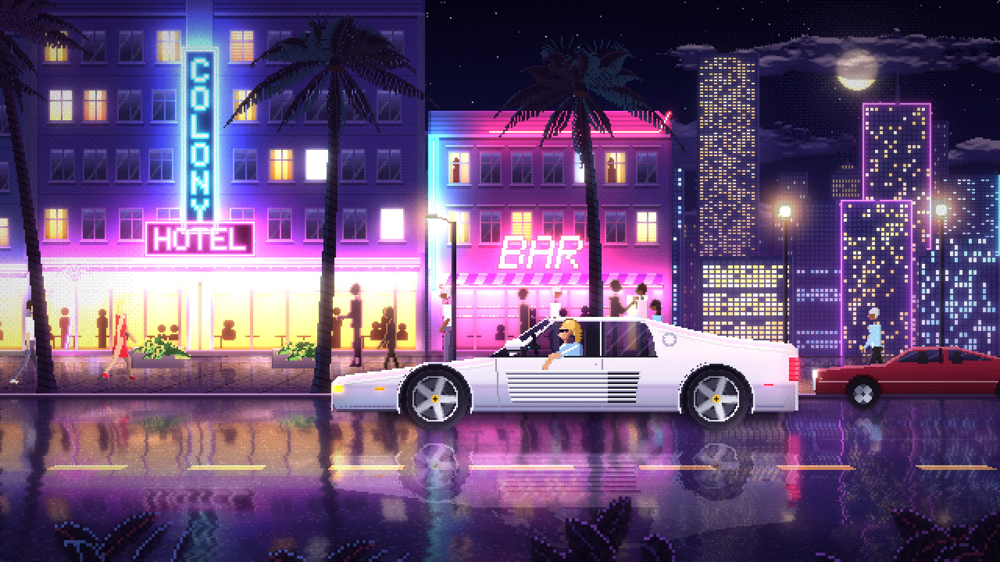

# Neon Drive — Endless Night Run

An endless, procedurally generated pixel-art night drive through a neon Art Deco
beach strip. It's a white 80s supercar cruising past hotels, bars and motels under
palm trees, with wet-road reflections and bloom. Everything is drawn in code:
there are no image assets. It runs in any modern browser and is built to be
screen-captured as the visual for long mixtapes.

## Run it

Open `index.html` in a browser. Double-clicking the file works (no server needed),
or you can serve the folder with any static server. `dist/neon-drive.html` is the
same thing bundled into one file you can copy anywhere (rebuild it with
`node tools/build.js`).

| Key | Action |
| --- | --- |
| `F` / double-click | Fullscreen |
| `H` | Hide the hint box |
| `Space` | Pause |
| `D` | FPS / frame-time stats |

URL options: `?seed=1234` picks a different city, `?q=0|1|2` forces a quality
level (default: automatic), and `?debug` shows stats on load.

## Recording for YouTube

The world renders at **640×360**. That scales by an exact whole number to every
standard 16:9 size, so pixels stay perfectly square and crisp: 2× for 720p,
3× for 1080p, 4× for 1440p and 6× for 4K.

1. Put the browser fullscreen (`F`) on a 1080p or 4K display.
2. Capture at 60 fps with OBS (Display or Window capture).
3. The mouse cursor hides itself after 2.5 s of inactivity, and so does the hint box.

## How it works

- `src/core.js`: constants, deterministic RNG, dithering, the pixel-buffer
  sprite authoring and noise.
- `src/art/*`: procedural art: sky and moon, three depths of skyline plus the
  causeway, Art Deco facades lit by their own neon (baked light maps), palms,
  pedestrians with skeletal walk cycles, the hero car and traffic, and street props.
- `src/world.js`: the endless world. Parallax sequences spawn to the left
  and retire off the right. Building art is generated in small time slices
  between frames, so nothing stalls the frame.
- `src/renderer.js`: the colour and emissive buffers, ground-plane
  ("Mode 7") sidewalk and road, streaky wet-asphalt reflections, bloom and vignette.
- `src/main.js`: a fixed 60 Hz simulation with refresh-snapped timing, adaptive
  quality, and integer-scale presentation.
